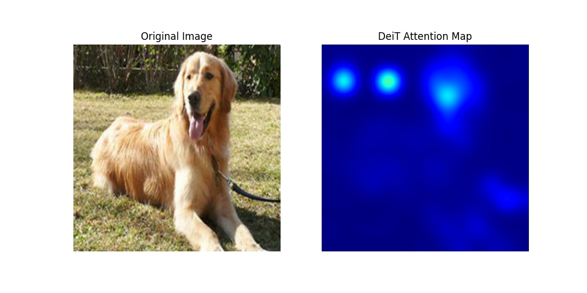
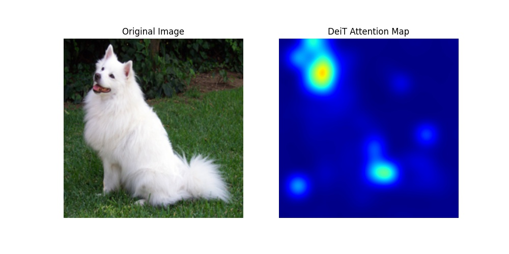
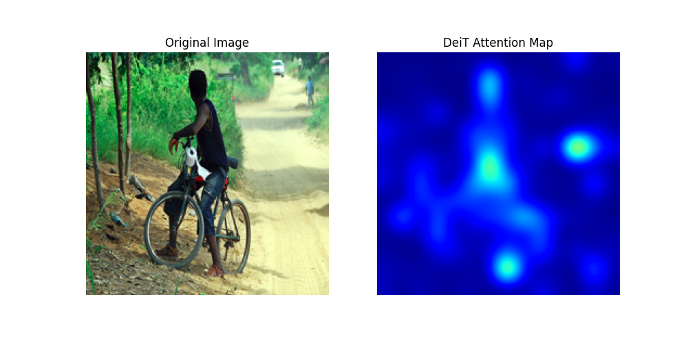

## 📊 实验结果与可视化 (Experimental Results)

本项目使用 **DeiT-Tiny** 在标准学术样本上进行了注意力分析。通过 **Attention Rollout** 算法，我们成功提取了模型最后一层的自注意力分布。

| 原始图像 (Input) | 注意力热力图 (Attention Map) | 分析说明 |
| :--- | :--- | :--- |
|  |  | **目标聚焦**: 能量高度集中于犬类五官，背景噪声抑制显著。 |
|  |  | **边缘感知**: 准确勾勒出工业目标的刚性线条与轮廓。 |
|  |  | **语义聚合**: 在复杂背景下精准锁定人体主干区域。 |

### 🔍 现象讨论：注意力稀疏性 (Sparsity)
在可视化结果中观察到明显的“深色聚焦”现象。这表明 Transformer 架构在经过深度训练后，其自注意力矩阵展现出极高的**稀疏性**。模型能够自动通过全局上下文建模，将权重分配给具有判别性的语义 Patch，从而实现鲁棒的对象定位。

